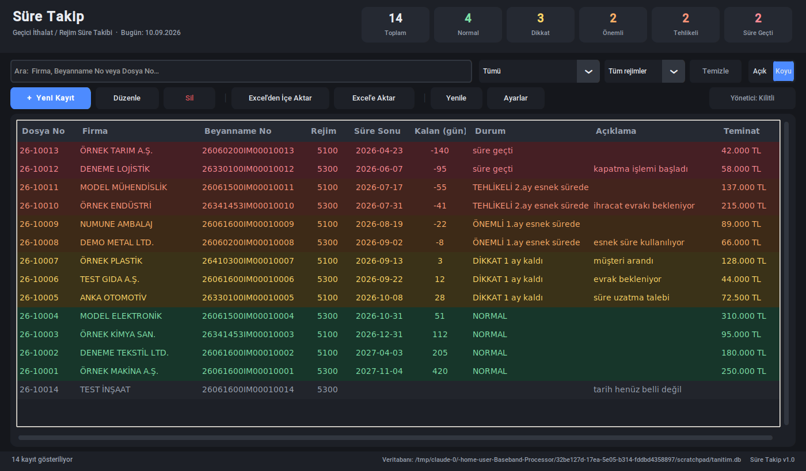

# Süre Takip

Geçici ithalat / rejim süre takip Excel dosyasının yerini alan, **tamamen
çevrimdışı** çalışan masaüstü uygulaması. Python + CustomTkinter ile yazılmıştır,
veriler yerel bir **SQLite** veritabanında saklanır.



---

## Kurulum — hangi yolu seçmeliyim?

Uygulamayı kullanacak kişinin **hiçbir komut yazmasına gerek yoktur.** Üç yol var;
ilki en kolayı:

| | Yol | Kullanacak kişinin yapması gereken | Bilgisayarda Python gerekir mi? |
|---|---|---|---|
| **A** | Hazır `.exe` | `SureTakip.exe`'ye çift tıklamak | ❌ Hayır |
| **B** | `KURULUM.bat` | Bir kez kuruluma, sonra masaüstü simgesine çift tıklamak | ✅ Evet (bir kez) |
| **C** | `Sure Takip.command` | Dosyaya çift tıklamak (macOS / Linux) | ✅ Evet |

---

### A) Hazır `.exe` — hiçbir kurulum istemiyorum  *(önerilen)*

Karşı bilgisayarda Python, kütüphane, kurulum **hiçbir şey** gerekmez. Tek bir
dosya kopyalanır, çift tıklanır, açılır.

**`.exe` dosyasını iki şekilde elde edebilirsiniz:**

**1. GitHub üzerinde otomatik üretim** (Windows bilgisayarınız yoksa bile olur)

1. Bu deponun **Actions** sekmesine girin
2. Soldan **"Süre Takip — Windows EXE"** iş akışını seçin
3. **Run workflow** düğmesine basın ve bitmesini bekleyin (~3 dk)
4. Açılan çalıştırma sayfasının altındaki **Artifacts** bölümünden
   `SureTakip-windows-exe` dosyasını indirin, zip'ten çıkarın

**2. Kendi Windows bilgisayarınızda üretim**

`araclar\derle_exe.bat` dosyasına çift tıklayın. İşlem bitince
`dist\SureTakip.exe` oluşur.

**Sonra:** `SureTakip.exe` dosyasını babanızın bilgisayarında bir klasöre
(örn. `Belgeler\Süre Takip\`) kopyalayın, simgesine sağ tıklayıp
**"Başlat ekranına sabitle"** ya da masaüstüne kısayol oluşturun. Hepsi bu.

> **Önemli:** Veritabanı (`sure_takip.db`) `.exe` ile **aynı klasörde** oluşur.
> Bu yüzden `.exe`'yi kendi klasörüne koyun, Masaüstü'ne doğrudan atmayın —
> yoksa veritabanı da masaüstünde durur. Yedek almak için o klasörü kopyalamak
> yeterlidir.

---

### B) `KURULUM.bat` — Windows'ta Python ile

Bilgisayarda Python varsa (ya da kurmaya isteklisiniz) bu yol daha kolaydır,
çünkü uygulamayı güncellemek için yalnızca `sure_takip.py` dosyasını
değiştirmek yeterli olur.

1. Bu klasörü babanızın bilgisayarına kopyalayın
2. **`KURULUM.bat`** dosyasına **bir kez** çift tıklayın. Bu dosya:
   - Python'u arar, yoksa nasıl kurulacağını ekranda anlatır
   - Gerekli kütüphaneleri (`customtkinter`, `openpyxl`) kurar
   - **Masaüstüne ve Başlat menüsüne "Süre Takip" kısayolu** koyar
3. Bundan sonra masaüstündeki simgeye çift tıklamak yeterli

Kısayol `pythonw.exe`'yi hedef aldığı için açılışta **siyah konsol penceresi
görünmez**; normal bir Windows programı gibi davranır.

Kısayol oluşmazsa sorun değil: klasördeki **`Sure Takip - Baslat.bat`**
dosyasına çift tıklamak da uygulamayı açar.

---

### C) macOS / Linux

**`Sure Takip.command`** dosyasına çift tıklayın. Eksik kütüphane varsa kendisi
kurar, sonra uygulamayı açar.

macOS'ta ilk açılışta "geliştirici doğrulanamadı" uyarısı çıkarsa: dosyaya
**sağ tıklayıp → Aç** deyin, bir kez onaylayın; sonraki açılışlarda sormaz.

Linux'ta Tk paketi ayrıca gerekir:

```bash
sudo apt install python3-tk        # Debian / Ubuntu
sudo dnf install python3-tkinter   # Fedora
```

---

### D) Geliştirici kurulumu (komut satırı)

```bash
pip install -r requirements.txt      # veya: pip install customtkinter openpyxl
python sure_takip.py
```

İlk açılışta uygulamanın bulunduğu klasörde `sure_takip.db` dosyası oluşturulur.
Tüm kayıtlar bu dosyada tutulur; uygulama kapansa bile veriler kaybolmaz.

### Ek komutlar

| Komut | Açıklama |
|---|---|
| `python sure_takip.py` | Uygulamayı açar |
| `python sure_takip.py --test` | Arayüz açmadan iş kurallarını doğrular (35 test) |
| `python sure_takip.py --sifre-sifirla` | Yönetici şifresini varsayılana (`admin123`) döndürür |
| `python sure_takip.py --veritabani D:\takip\veri.db` | Farklı bir veritabanı dosyası kullanır |

---

## Veri yapısı

| # | Sütun | Tip | Not |
|---|---|---|---|
| 1 | Dosya No | Metin | |
| 2 | Firma | Metin | |
| 3 | Beyanname No | Metin | |
| 4 | Rejim | Metin / Sayı | örn. 5300, 5100 |
| 5 | Süre Sonu | Tarih | `YYYY-AA-GG` |
| 6 | **Durum** | **Otomatik** | **Salt okunur — elle yazılamaz** |
| 7 | Açıklama | Metin | |
| 8 | Teminat | Metin / Sayı | |

Tabloda ayrıca türetilmiş bir **Kalan (gün)** sütunu gösterilir; süre sonuna kaç
gün kaldığını (negatifse kaç gün geçtiğini) belirtir. Bu sütun da veritabanında
saklanmaz, her açılışta hesaplanır.

---

## Durum kuralı

Excel'deki `G` sütunu formülünün birebir karşılığıdır:

```
=IF(F="","",
  IF(F-TODAY()>30,"NORMAL",
  IF(F>=TODAY(),"DİKKAT 1 ay kaldı",
  IF(TODAY()-F<=30,"ÖNEMLİ 1.ay esnek sürede",
  IF(TODAY()-F<=60,"TEHLİKELİ 2.ay esnek sürede","süre geçti")))))
```

| Koşul | Durum | Renk |
|---|---|---|
| Süre Sonu boş | *(boş)* | Gri |
| Süre sonuna **30 günden fazla** var | `NORMAL` | Yeşil |
| Süre sonuna **0–30 gün** var | `DİKKAT 1 ay kaldı` | Sarı |
| Süre **1–30 gün** geçmiş | `ÖNEMLİ 1.ay esnek sürede` | Turuncu |
| Süre **31–60 gün** geçmiş | `TEHLİKELİ 2.ay esnek sürede` | Koyu turuncu |
| Süre **60 günden fazla** geçmiş | `süre geçti` | Kırmızı |

Durum tablodaki satırları renklendirir ve üstteki özet kartlarında sayılır.
Kartlara tıklayarak o duruma göre anında filtreleyebilirsiniz.

> **Neden elle değiştirilemez?**
> `durum` bilinçli olarak bir veritabanı sütunu **değildir**. Yalnızca Süre
> Sonu saklanır; Durum her görüntülemede yeniden hesaplanır. Böylece veritabanına
> doğrudan müdahale edilse bile Durum bozulamaz.

---

## Yetkilendirme

Varsayılan yönetici şifresi: **`admin123`**

| İşlem | Şifre gerekir mi? |
|---|---|
| Yeni kayıt ekleme | ❌ Hayır — herkes ekleyebilir |
| Kayıt düzenleme | ✅ Evet |
| Kayıt silme | ✅ Evet (şifre + onay) |
| İçe aktarımda mevcut kayıtları silme | ✅ Evet |
| Ayarları açma | ✅ Evet |
| Durum sütununu değiştirme | ⛔ Hiçbir şekilde mümkün değil |

Şifre veritabanında düz metin olarak değil, **PBKDF2-HMAC-SHA256** (200.000
döngü, rastgele tuz) özeti olarak saklanır.

**Şifreyi değiştirmek için** üç yol vardır:

1. Uygulama içinden: **Ayarlar → Yönetici Şifresini Değiştir**
2. Şifre unutulduysa: `python sure_takip.py --sifre-sifirla`
3. Kurulum öncesi: `sure_takip.py` içindeki `VARSAYILAN_SIFRE` sabiti
   (yalnızca veritabanı ilk kez oluşturulurken geçerlidir)

### Yönetici oturumu

Varsayılan olarak **her düzenleme ve silme işleminde** şifre sorulur. Yoğun
çalışırken bu yorucu olursa **Ayarlar → Yönetici Oturumu** bölümünden 5, 15 veya
60 dakikalık bir süre seçebilirsiniz; bu sürede şifre tekrar sorulmaz. Araç
çubuğundaki **Yönetici: Açık** düğmesine basarak oturumu istediğiniz an
kapatabilirsiniz.

---

## Excel içe / dışa aktarma

### Excel'den İçe Aktar

Mevcut takip dosyanızı doğrudan okuyabilir. Desteklenenler:

* Aynı sayfada **birden fazla blok** (5300 bloğu, 5100 bloğu…) ve her bloğun
  kendi başlık satırı
* Blok başındaki tek başına duran rejim numarasının (örn. `5300`), o bloktaki
  rejim hücresi boş olan kayıtlara otomatik atanması
* Başlık adı varyasyonları: `Beyanname No` / `Beyanna No`, `Süre Sonu` /
  `Bitiş Tarihi` / `Vade` gibi
* Tarih biçimleri: `YYYY-AA-GG`, `GG.AA.YYYY`, `GG/AA/YYYY`, gerçek Excel tarih
  hücreleri ve Excel tarih seri numaraları
* Verisi olmayan (yalnızca formülle dolu) satırların atlanması

İçe aktarırken iki seçenek sunulur:

* **Mevcutları koru** → yalnızca yeni kayıtlar eklenir; aynı *Dosya No +
  Beyanname No* ikilisine sahip kayıtlar atlanır
* **Sil ve yükle** → mevcut kayıtlar silinip dosyadakilerle değiştirilir
  *(yönetici şifresi ister)*

> Dosyadaki `Durum` sütunu **okunmaz**. Durum her zaman Süre Sonu'ndan yeniden
> hesaplanır; böylece elle bozulmuş durum değerleri uygulamaya taşınmaz.

### Excel'e Aktar

Kayıtlar biçimlendirilmiş bir `.xlsx` dosyasına yazılır: başlık satırı sabitlenir,
otomatik filtre açılır, Süre Sonu gerçek tarih hücresi olarak, Durum ise
ekrandakiyle aynı renk dolgusuyla kaydedilir. Ekranda filtre etkinse yalnızca
görünen kayıtları mı yoksa tümünü mü aktaracağınız sorulur.

---

## Arama ve filtreleme

* **Arama çubuğu** — Firma, Beyanname No ve Dosya No alanlarında anlık (harf
  yazdıkça) filtreleme yapar. Türkçe karakterlere duyarsızdır: `isin` yazmak
  `IŞIN`'ı, `gurpom` yazmak `GÜRPOM`'u bulur.
* **Durum filtresi** — tek bir duruma göre daraltır.
* **Rejim filtresi** — veritabanındaki rejim kodlarından otomatik doldurulur.
* **Sütun başlıkları** — tıklayınca o sütuna göre sıralar, tekrar tıklayınca
  ters çevirir. Süre Sonu'na göre sıralamada tarihi boş kayıtlar daima sona gider.

---

## Klavye kısayolları

| Kısayol | İşlem |
|---|---|
| `Ctrl` + `N` | Yeni kayıt |
| `Ctrl` + `F` | Arama kutusuna geç |
| `Ctrl` + `E` | Excel'e aktar |
| `Delete` | Seçili kaydı sil (şifre ister) |
| `F5` | Yenile |
| Çift tıklama | Seçili kaydı düzenle (şifre ister) |
| `Esc` | Açık pencereyi kapat |

---

## Veri saklama ve yedekleme

Tüm veriler tek bir dosyada tutulur: **`sure_takip.db`**

Dosyanın konumu:

| Çalışma biçimi | Veritabanının yeri |
|---|---|
| `python sure_takip.py` | `sure_takip.py` ile aynı klasör |
| `SureTakip.exe` (paketlenmiş) | **`.exe` ile aynı klasör** |
| Yukarıdaki klasör salt okunursa | `<kullanıcı klasörü>/SureTakip/` |

Güncel yol her zaman uygulamanın **alt bilgi çubuğunda** yazılıdır; emin
olmak isterseniz oraya bakın.

> Paketlenmiş sürümde veritabanı, PyInstaller'ın geçici çıkarma klasörüne
> değil `.exe`'nin yanına yazılır — aksi hâlde program her kapandığında tüm
> kayıtlar silinirdi.

Yedeklemek için bu dosyayı kopyalamanız yeterlidir. Uygulama açıkken WAL kipi
kullanıldığından, yedek alırken `sure_takip.db-wal` ve `sure_takip.db-shm`
dosyalarını da kopyalayın ya da yedeği uygulama kapalıyken alın.

Dosyayı başka bir yere koymak isterseniz:

```bash
python sure_takip.py --veritabani "D:\Ortak\takip\sure_takip.db"
```

> Uygulama hiçbir ağ bağlantısı kurmaz; kurulum sonrası internet gerektirmez.

---

## Sorun giderme

| Belirti | Çözüm |
|---|---|
| `ModuleNotFoundError: No module named 'customtkinter'` | `pip install customtkinter` |
| `ModuleNotFoundError: No module named 'tkinter'` (Linux) | `sudo apt install python3-tk` |
| Excel düğmeleri "Eksik kütüphane" diyor | `pip install openpyxl` |
| Şifre unutuldu | `python sure_takip.py --sifre-sifirla` |
| "Dosya açık" hatasıyla dışa aktarılamıyor | Hedef `.xlsx` dosyasını Excel'de kapatın |
| Satır renkleri görünmüyor | Uygulama Tk'nin bilinen etiket-rengi hatasını kendisi düzeltir; sorun sürerse Python'u güncelleyin |
| `KURULUM.bat` "Python bulunamadi" diyor | Python'u kurarken **"Add python.exe to PATH"** kutusunu işaretlemeyi atlamış olabilirsiniz. Python'u kaldırıp bu kutu işaretli olarak yeniden kurun, ya da A yolundaki hazır `.exe`'yi kullanın |
| Masaüstü kısayolu oluşmadı | Klasördeki `Sure Takip - Baslat.bat` dosyasına çift tıklayın; aynı işi yapar |
| `.bat` dosyası açılıp hemen kapanıyor | Dosyaya sağ tıklayıp **Düzenle** ile açın ve komut satırından çalıştırarak hatayı görün; ya da `Sure Takip - Baslat.bat` yerine `KURULUM.bat`'ı çalıştırın |
| macOS: "geliştirici doğrulanamadı" | `Sure Takip.command` dosyasına **sağ tıklayıp → Aç** deyin, bir kez onaylayın |
| macOS/Linux: "permission denied" | `chmod +x "Sure Takip.command"` komutunu bir kez çalıştırın |
| `.exe` açılıyor ama kayıtlar kayboluyor | `.exe`'yi her açılışta farklı bir klasörden çalıştırıyor olabilirsiniz. Veritabanı `.exe`'nin yanında oluşur; `.exe`'yi sabit bir klasörde tutun (alt bilgi çubuğunda güncel veritabanı yolu yazılıdır) |

---

## Dosya yapısı

```
sure_takip/
├── sure_takip.py                # Uygulamanın tamamı (tek dosya)
│
├── KURULUM.bat                  # Windows: bir kez çift tıkla — kurar + kısayol yapar
├── Sure Takip - Baslat.bat      # Windows: klasörden çift tıklayarak çalıştır
├── Sure Takip.command           # macOS / Linux: çift tıklayarak çalıştır
│
├── araclar/
│   ├── derle_exe.bat            # Tek dosyalık SureTakip.exe üretir
│   └── kisayol_olustur.ps1      # Masaüstü/Başlat kısayolunu oluşturur
│
├── simge.ico                    # Uygulama simgesi (kısayol ve .exe için)
├── requirements.txt             # Bağımlılıklar
├── README.md                    # Bu belge
├── ekran-goruntusu.png          # Belgelerdeki ekran görüntüsü
└── sure_takip.db                # İlk çalıştırmada otomatik oluşur (depoya girmez)
```

Ayrıca depo kökünde:

```
.github/workflows/sure-takip-exe.yml   # GitHub'da Windows .exe üretir
```

`sure_takip.py` içindeki bölümler:

| Bölüm | İçerik |
|---|---|
| 1 | Sabitler, renk paleti, sütun tanımları |
| 2 | İş kuralları (`durum_hesapla`, tarih ayıklama, Türkçe arama) |
| 3 | Şifre özetleme ve doğrulama |
| 4 | SQLite veri erişim katmanı |
| 5 | Excel içe / dışa aktarma |
| 6 | Ortak arayüz bileşenleri ve pencereler |
| 7 | Ana pencere |
| 8 | İş kuralı testleri (`--test`) |
| 9 | Giriş noktası (`main`) |
